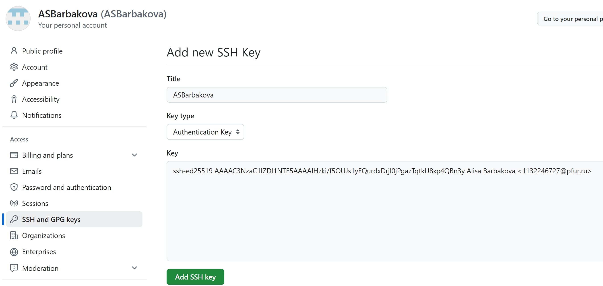

---
## Front matter
title: "Отчет по лабораторной работе №2"
subtitle: "Дисциплина: архитектура компьютера"
author: "Барбакова Алиса"

## Generic otions
lang: ru-RU
toc-title: "Содержание"

## Bibliography
bibliography: bib/cite.bib
csl: pandoc/csl/gost-r-7-0-5-2008-numeric.csl

## Pdf output format
toc: true # Table of contents
toc-depth: 2
lof: true # List of figures
fontsize: 13pt
linestretch: 1.5
papersize: a4
documentclass: scrreprt
## I18n polyglossia
polyglossia-lang:
  name: russian
  options:
	- spelling=modern
	- babelshorthands=true
polyglossia-otherlangs:
  name: english
## I18n babel
babel-lang: russian
babel-otherlangs: english
## Fonts
mainfont: IBM Plex Serif
romanfont: IBM Plex Serif
sansfont: IBM Plex Sans
monofont: IBM Plex Mono
mathfont: STIX Two Math
mainfontoptions: Ligatures=Common,Ligatures=TeX,Scale=0.94
romanfontoptions: Ligatures=Common,Ligatures=TeX,Scale=0.94
sansfontoptions: Ligatures=Common,Ligatures=TeX,Scale=MatchLowercase,Scale=0.94
monofontoptions: Scale=MatchLowercase,Scale=0.94,FakeStretch=0.9
mathfontoptions:

## Biblatex
biblatex: true
biblio-style: "gost-numeric"
biblatexoptions:
  - parentracker=true
  - backend=biber
  - hyperref=auto
  - language=auto
  - autolang=other*
  - citestyle=gost-numeric
## Pandoc-crossref LaTeX customization
figureTitle: "Рис."
tableTitle: "Таблица"
listingTitle: "Листинг"
lofTitle: "Список иллюстраций"
lotTitle: "Список таблиц"
lolTitle: "Листинги"
## Misc options
indent: true
header-includes:
  - \usepackage{indentfirst}
  - \usepackage{float} # keep figures where there are in the text
  - \floatplacement{figure}{H} # keep figures where there are in the text
---

# Цель

Целью работы является изучить идеологию и применение средств контроля
версий. Приобрести практические навыки по работе с системой git.

# Задание

Ознакомится с сайтом github и научиться базовым навыкам работы с ним.

# Выполнение лабораторной работы

## Настройка github

Регистрируюсь на платформе github (рис. [-@fig:001])

{#fig:001 width=70%}

Заполняю основные данные, аккаунт создан (рис. [-@fig:002])

{#fig:002 width=70%}

## Базовая настройка git

Открываю терминал в виртуальной машине и делаю предварительную
конфигурацию git. Командой git config --global user.name "" указываю своё имя, а с
помощью git config --global user.email "" - свою почту (рис. [-@fig:003])

{#fig:003 width=70%}

Настраиваю utf-8 в выводе git (рис. [-@fig:004])

{#fig:004 width=70%}

Далее я задаю имя начальной ветки - master (рис. [-@fig:005])

{#fig:005 width=70%}

Устанавливаю параметр autocrlf в значение input, так как работаю в системе Linux,
чтобы выполнять конвертацию CRLF в LF только во время коммитов (рис. [-@fig:006])

{#fig:006 width=70%}

Устанавливаю параметр safecrlf в значение warn, чтобы Git проверял обратимость
преобразования (рис. [-@fig:007])

{#fig:007 width=70%}

## Создание SSH ключа

Для идентификации меня на сервере репозиториев генерирую приватный и
открытый ключи в терминале командой ssh-keygen -C (рис. [-@fig:008])

{#fig:008 width=70%}

После этого копирую этот ключ из локальной консоли в буфер обмена командой cat
(рис. [-@fig:009])

{#fig:009 width=70%}

Далее открываю свою учётную запись в github. Открываю настройки и вкладку
SSH и GPG keys (рис. [-@fig:010])

{#fig:010 width=70%}

Вставляю ключ в нужное поле и даю ему название (рис. [-@fig:011]).

{#fig:011 width=70%}

## Создание рабочего пространства и репозитория курса на основе шаблона

Открываю терминал в виртуальной машине и создаю каталог для предмета
“Архитектура компьютера” с помощью mkdir (рис. [-@fig:012])

{#fig:012 width=70%}

## Создание репозитория курса на основе шаблона

В браузере открываю страницу репозитория с шаблоном курса по ссылке
https://github.com/yamadharma/course-directory-student-template. Затем нажимаю на
кнопку «Use this template», чтобы создать свой репозиторий на основе этого
шаблона (рис. [-@fig:013])

{#fig:013 width=70%}

Задаю имя репозиторию - study_2024–2025_arh-pc и создаю его (рис. [-@fig:014])

{#fig:014 width=70%}

Далее перехожу обратно в терминал виртуальной машины и открываю каталог
курса командой cd (рис. [-@fig:015])

{#fig:015 width=70%}

После этого я клонирую созданный репозорий командой git clone –recursive
git@github.com:/study_2024–2025_arh-pc.git arch-pc (рис. [-@fig:016])

{#fig:016 width=70%}

## Настройка каталога курса

Перехожу в каталог arch-pc в терминале с помощь утилиты cd (рис. [-@fig:017])

{#fig:017 width=70%}

Удаляю лишние файлы командой rm (рис. [-@fig:018])

{#fig:018 width=70%}

Далее создаю необходимые каталоги (рис. [-@fig:019])

{#fig:019 width=70%}e

Отправляю созданные каталоги с локального репозитория на сервер: добавляю их с
помощью команды git add, затем комментирую и фиксирую изменения на сервере,
используя git commit с описанием добавления курса. (рис. [-@fig:020])

{#fig:020 width=70%}

С помощью git push отправляю всё на сайт (рис. [-@fig:021])

{#fig:021 width=70%}

После этого я проверяю корректность выполнения команд на сервере (рис. [-@fig:022])

{#fig:022 width=70%}

# Задание для самостоятельной работы

## Задание 1

Используя cd, перехожу в директорию labs/lab02/report. Создаю в каталоге файл для
отчета по второй лабораторной работе с помощью touch (рис. [-@fig:023])

{#fig:023 width=70%}

# Выводы

В ходе выполнения этой лабораторной работы я приобрела практические навыки
работы с Git, а также ознакомилась с концепциями и использованием систем
контроля версий.

# Список литературы{.unnumbered}

1. [Архитектура ЭВМ](https://esystem.rudn.ru/pluginfile.php/2089083/mod_resource/content/0/%D0%9B%D0%B0%D0%B1%D0%BE%D1%80%D0%B0%D1%82%D0%BE%D1%80%D0%BD%D0%B0%D1%8F%20%D1%80%D0%B0%D0%B1%D0%BE%D1%82%D0%B0%20%E2%84%963.%20%D0%AF%D0%B7%D1%8B%D0%BA%20%D1%80%D0%B0%D0%B7%D0%BC%D0%B5%D1%82%D0%BA%D0%B8%20.pdf)
