---
## Front matter
title: "Отчёт по лабораторной работе №5"
subtitle: "Дисциплина: архитектура компьютера"
author: "Барбакова Алиса Саяновна"

## Generic otions
lang: ru-RU
toc-title: "Содержание"

## Bibliography
bibliography: bib/cite.bib
csl: pandoc/csl/gost-r-7-0-5-2008-numeric.csl

## Pdf output format
toc: true # Table of contents
toc-depth: 2
lof: true # List of figures
fontsize: 13pt
linestretch: 1.5
papersize: a4
documentclass: scrreprt
## I18n polyglossia
polyglossia-lang:
  name: russian
  options:
	- spelling=modern
	- babelshorthands=true
polyglossia-otherlangs:
  name: english
## I18n babel
babel-lang: russian
babel-otherlangs: english
## Fonts
mainfont: IBM Plex Serif
romanfont: IBM Plex Serif
sansfont: IBM Plex Sans
monofont: IBM Plex Mono
mathfont: STIX Two Math
mainfontoptions: Ligatures=Common,Ligatures=TeX,Scale=0.94
romanfontoptions: Ligatures=Common,Ligatures=TeX,Scale=0.94
sansfontoptions: Ligatures=Common,Ligatures=TeX,Scale=MatchLowercase,Scale=0.94
monofontoptions: Scale=MatchLowercase,Scale=0.94,FakeStretch=0.9
mathfontoptions:
## Biblatex
biblatex: true
biblio-style: "gost-numeric"
biblatexoptions:
  - parentracker=true
  - backend=biber
  - hyperref=auto
  - language=auto
  - autolang=other*
  - citestyle=gost-numeric
## Pandoc-crossref LaTeX customization
figureTitle: "Рис."
tableTitle: "Таблица"
listingTitle: "Листинг"
lofTitle: "Список иллюстраций"
lolTitle: "Листинги"
## Misc options
indent: true
header-includes:
  - \usepackage{indentfirst}
  - \usepackage{float} # keep figures where there are in the text
  - \floatplacement{figure}{H} # keep figures where there are in the text
---


# Цель работы

Целью данной лабораторной работы является приобретение практических навыков работы в Midnight Commander, освоение инструкций языка ассемблера mov и int.

# Задание

1. Основы работы с Midnight Commander
2. Структура программы на языке ассемблера NASM
3. Подключение внешнего файла
4. Выполнение заданий для самостоятельной работы

# Теоретическое введение

Midnight Commander (или просто mc) — это программа, которая позволяет просматривать структуру каталогов и выполнять основные операции по управлению файловой системой, т.е. mc является файловым менеджером. Midnight Commander позволяет сделать работу с файлами более удобной и наглядной.
Для активации оболочки Midnight Commander достаточно ввести в командной строке mc и
нажать клавишу Enter (рис. 5.1).
В Midnight Commander используются функциональные клавиши F1 — F10 , к которым
привязаны часто выполняемые операции.
Программа на языке ассемблера NASM, как правило, состоит из трёх секций: секция кода программы (SECTION .text), секция инициированных (известных во время компиляции) данных (SECTION .data) и секция неинициализированных данных (тех, под которые во время компиляции только отводится память, а значение присваивается в ходе выполнения программы) (SECTION .bss).
Для объявления инициированных данных в секции .data используются директивы DB, DW, DD, DQ и DT, которые резервируют память и указывают, какие значения должны храниться в этой памяти:  
- DB (define byte) — определяет переменную размером в 1 байт;  
- DW (define word) — определяет переменную размеров в 2 байта (слово);  
- DD (define double word) — определяет переменную размером в 4 байта (двойное слово);  
- DQ (define quad word) — определяет переменную размером в 8 байт (учетве-
рённое слово);  
- DT (define ten bytes) — определяет переменную размером в 10 байт.   
Директивы используются для объявления простых переменных и для объявления массивов. Для определения строк принято использовать директиву DB в связи с особенностями хранения данных в оперативной памяти.
Инструкция языка ассемблера mov предназначена для дублирования данных источника в приёмнике. 
```NASM
mov dst,src
```
Здесь операнд dst — приёмник, а src — источник.
В качестве операнда могут выступать регистры (register), ячейки памяти (memory) и непосредственные значения (const).
Инструкция языка ассемблера int предназначена для вызова прерывания с
указанным номером. 
```NASM
int n
```
Здесь n — номер прерывания, принадлежащий диапазону 0–255. При программировании в Linux с использованием вызовов ядра sys_calls n=80h (принято задавать в шестнадцатеричной системе счисления).

# Выполнение лабораторной работы
## Основы работы с mc

Открываю Midnight Commander, введя в терминал mc (рис. [-@fig:001]).

{ #fig:001 width=70% }

Пользуясь клавишами, перехожу в каталог ~/work/arch-pc. (рис. [-@fig:002])

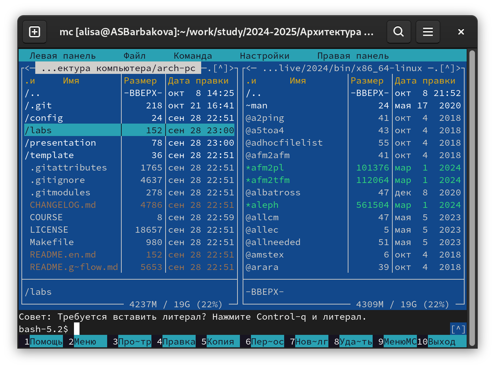{ #fig:002 width=70% }

С помощью функциональной клавиши F7 создаю папку lab05 (рис. [-@fig:003]).

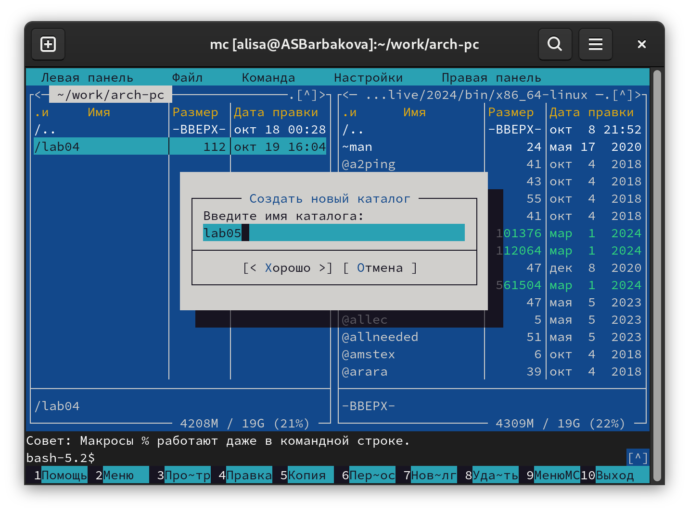{ #fig:003 width=70% }

Перехожу в созданный каталог (рис. [-@fig:004]).

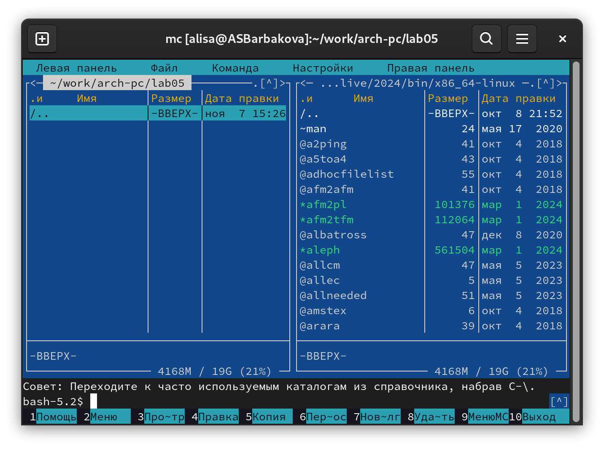{ #fig:004 width=70% }

В строке ввода пользуюсь командой touch и создаю файл lab5-1.asm, в котором буду работать (рис. [-@fig:005]).

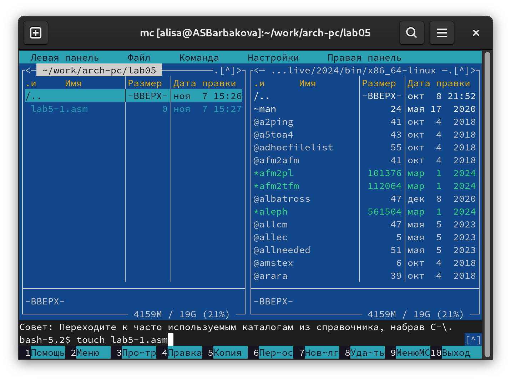{ #fig:005 width=70% }

## Структура программы на языке ассемблера NASM

С помощью функциональной клавиши F4 открываю созданный файл для редактирования в редакторе mcedit (рис. [-@fig:006]).

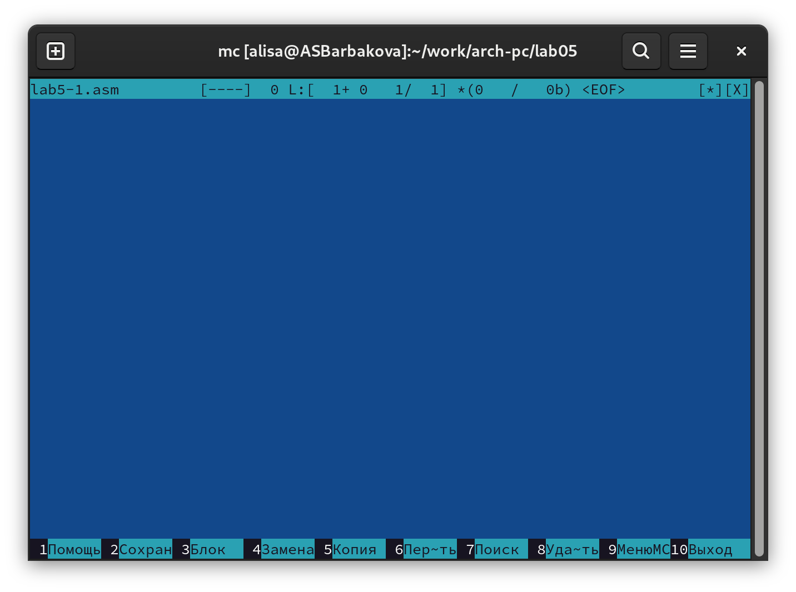{ #fig:006 width=70% }

Ввожу в файл код программы для запроса строки у пользователя (рис. [-@fig:007]). Далее выхожу из файла, сохраняя изменения.

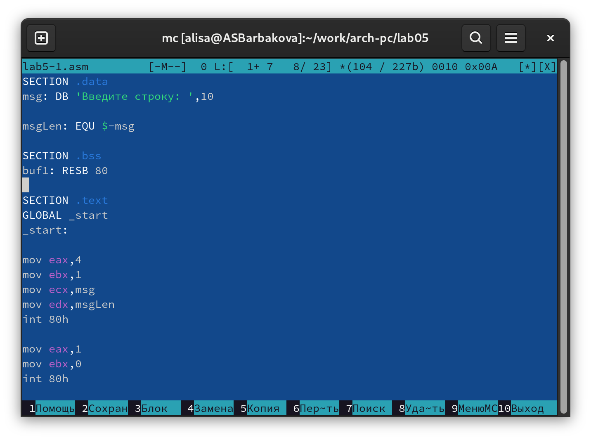{ #fig:007 width=70% }

С помощью функциональной клавиши F3 открываю файл для просмотра, чтобы проверить, содержит ли файл текст программы (рис. [-@fig:008]).

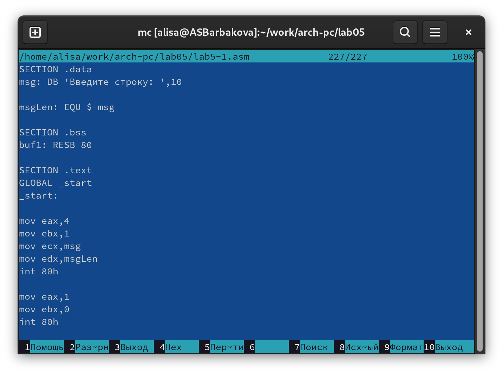{ #fig:008 width=70% }

Транслирую текст программы файла в объектный файл командой nasm -f elf lab5-1.asm. Выполняю компоновку объектного файла. Создался исполняемый файл lab5-1. Запускаю исполняемый файл. Программа выводит строку "Введите строку: ", я ввожу свои ФИО с клавиатуры (рис. [-@fig:009]).

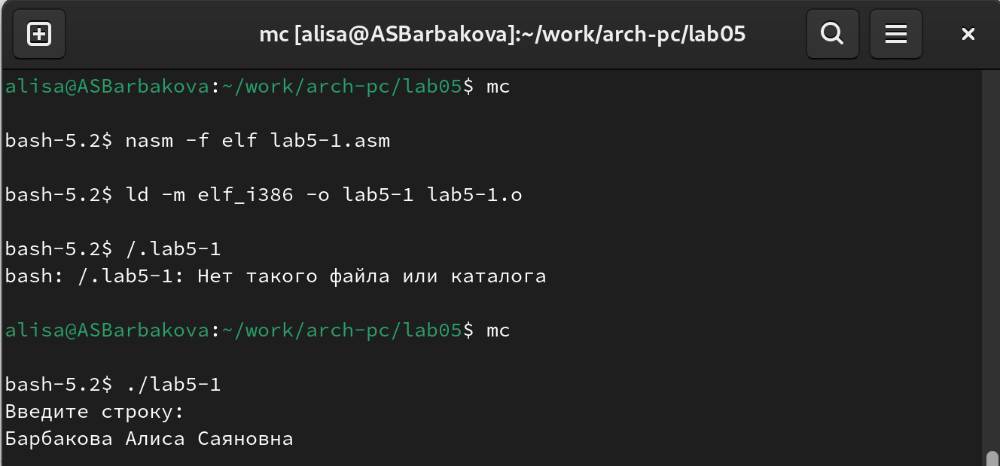{ #fig:009 width=70% }

## Подключение внешнего файла

Скачиваю файл in_out.asm со страницы курса в ТУИС (рис. [-@fig:010]).

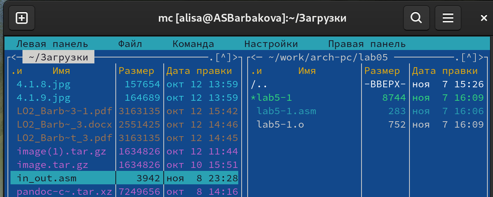{ #fig:010 width=70% }

С помощью F5 копирую файл in_out.asm из каталога Загрузки в созданный каталог lab05 (рис. [-@fig:011]).

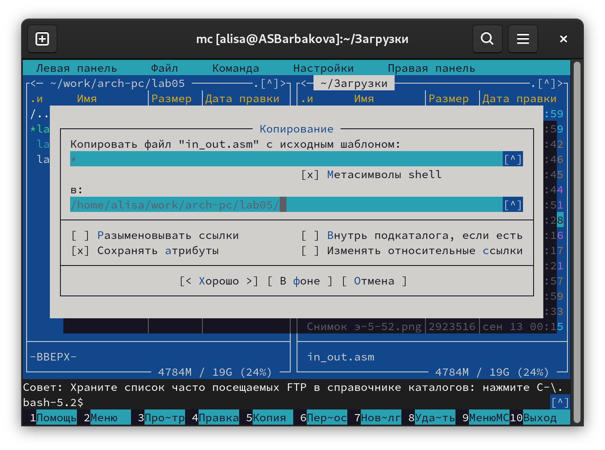{ #fig:011 width=70% }

С помощью функциональной клавиши F5 создаю копию файла lab5-1 в тот же каталог, но с другим именем. В появившемся окне mc прописываю имя для копии файла (рис. [-@fig:012]).

{ #fig:012 width=70% }

Исправляю текст программы в файле lab5-2.asm с использованием подпрограмм из
внешнего файла in_out.asm - sprintLF, sread и quit. (рис. [-@fig:013]).

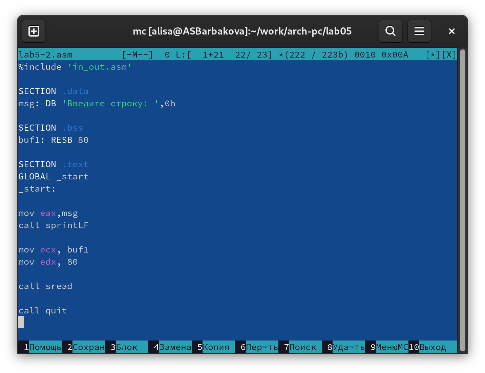{ #fig:013 width=70% }

 Создаю исполняемый файл и проверяю его работу. (рис. [-@fig:014]). 

{ #fig:014 width=70% }

Открываю файл lab5-2.asm для редактирования в mcedit. Изменяю в нем подпрограмму sprintLF на sprint. (рис. [-@fig:015]).

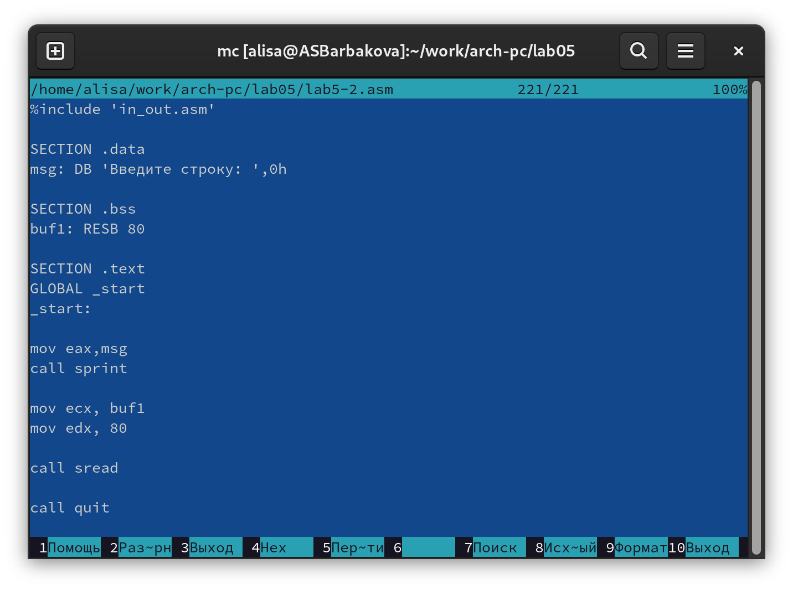{ #fig:015 width=70% }

Снова создаю исполняемый файл и проверяю его работу (рис. [-@fig:016]).

{ #fig:016 width=70% }

Разница подпрограммы sprint в том, что исполняемый файл запрашивает ввод без переноса на новую строку.

## Выполнение заданий для самостоятельной работы

1. Создаю копию файла lab5-1.asm с именем lab5-1-1.asm с помощью функциональной клавиши F5 (рис. [-@fig:017]).

{ #fig:017 width=70% }

Редактирую файл, изменяю программу так, чтобы она выводила вводимую пользователем строку (рис. [-@fig:018]).

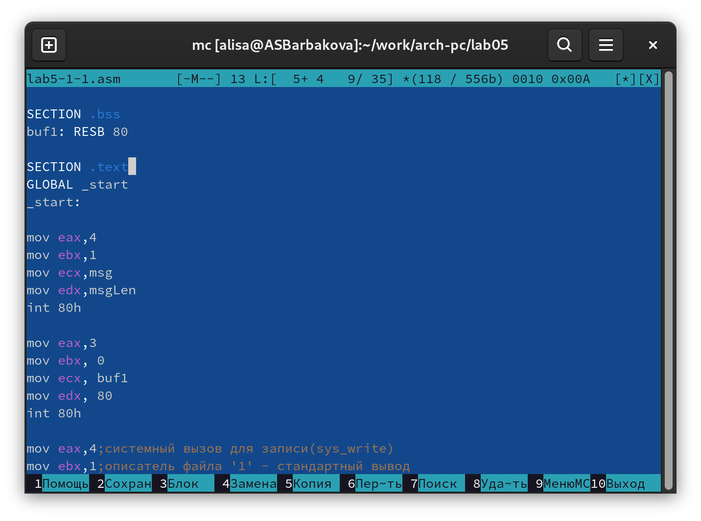{ #fig:018 width=70% }


Код программы:

```NASM
SECTION .data
msg: DB 'Введите строку: ',10

msgLen: EQU $-msg

SECTION .bss
buf1: RESB 80

SECTION .text
GLOBAL _start
_start:

mov eax,4
mov ebx,1
mov ecx,msg
mov edx,msgLen
int 80h

mov eax,3
mov ebx, 0
mov ecx, buf1
mov edx, 80
int 80h

mov eax,4;системный вызов для записи(sys_write)
mov ebx,1;описатель файла '1' - стандартный вывод
mov ecx,buf1;адрес строки buf1 в ecx
mov edx,buf1;размер строки buf1
int 80h;вызов ядра

mov eax,1
mov ebx,0
int 80h
```

2. Создаю объектный файл lab5-1-1.o, отдаю его на обработку компоновщику, получаю исполняемый файл lab5-1-1, запускаю полученный исполняемый файл. Ввожу свои ФИО, программа выводит введенные данные (рис. [-@fig:019]).
 
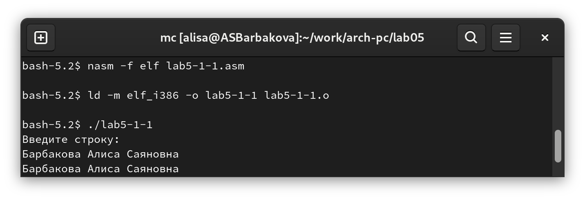{ #fig:019 width=70% }


3. Создаю копию файла lab5-2.asm с именем lab5-2-1.asm с помощью F5 (рис. [-@fig:020]).

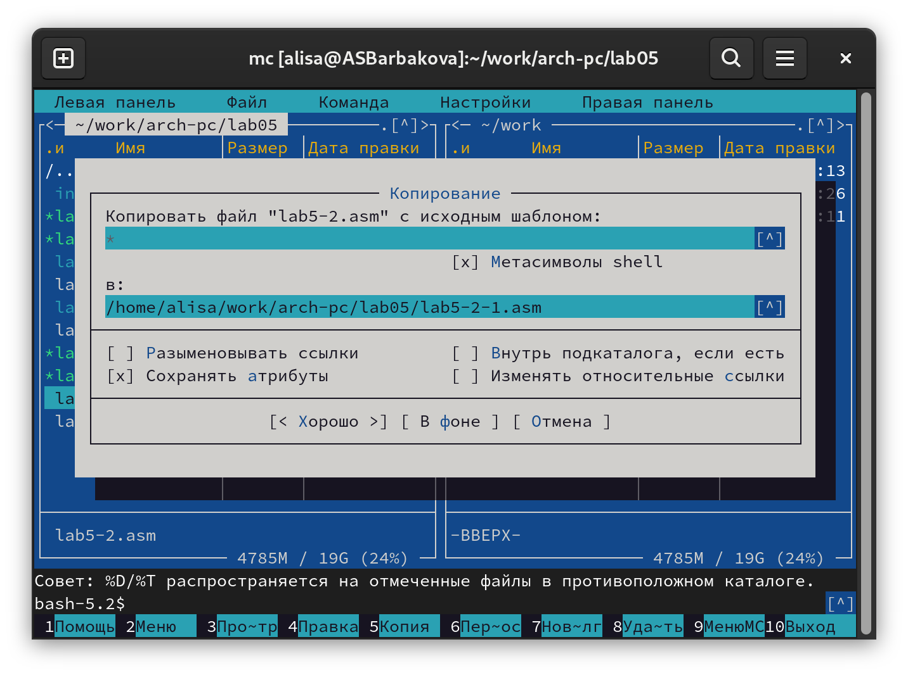{ #fig:020 width=70% }

С помощью F4 открываю созданный файл для редактирования. Изменяю программу так, чтобы, она выводила вводимую пользователем строку (рис. [-@fig:021]). 

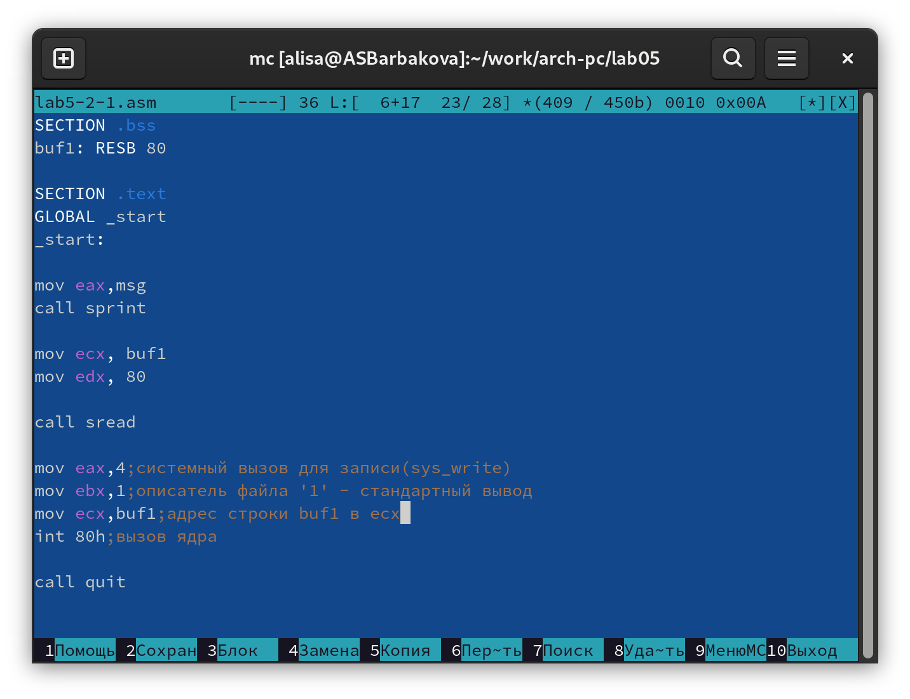{ #fig:021 width=70% }

Код программы:

```NASM
%include 'in_out.asm'

SECTION .data
msg: DB 'Введите строку: ',0h

SECTION .bss
buf1: RESB 80

SECTION .text
GLOBAL _start
_start:

mov eax,msg
call sprint

mov ecx, buf1
mov edx, 80

call sread

mov eax,4;системный вызов для записи(sys_write)
mov ebx,1;описатель файла '1' - стандартный вывод
mov ecx,buf1;адрес строки buf1 в ecx

int 80h;вызов ядра

call quit
```

4. Создаю исполняемый файл lab5-2-1, запускаю полученный исполняемый файл. Программа запрашивает ввод без переноса на новую строку, ввожу свои ФИО, далее программа выводит введенные мною данные (рис. [-@fig:022]).

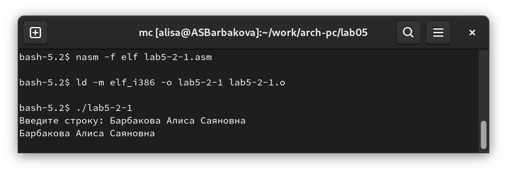{ #fig:022 width=70% }


# Выводы

При выполнении данной лабораторной работы я приобрела практические навыки работы в Midnight Commander, а также освоила инструкции языка ассемблера mov и int.

# Список литературы{.unnumbered}

1. [Лабораторная работа №5](https://esystem.rudn.ru/pluginfile.php/2089085/mod_resource/content/0/%D0%9B%D0%B0%D0%B1%D0%BE%D1%80%D0%B0%D1%82%D0%BE%D1%80%D0%BD%D0%B0%D1%8F%20%D1%80%D0%B0%D0%B1%D0%BE%D1%82%D0%B0%20%E2%84%965.%20%D0%9E%D1%81%D0%BD%D0%BE%D0%B2%D1%8B%20%D1%80%D0%B0%D0%B1%D0%BE%D1%82%D1%8B%20%D1%81%20Midnight%20Commander%20%28%29.%20%D0%A1%D1%82%D1%80%D1%83%D0%BA%D1%82%D1%83%D1%80%D0%B0%20%D0%BF%D1%80%D0%BE%D0%B3%D1%80%D0%B0%D0%BC%D0%BC%D1%8B%20%D0%BD%D0%B0%20%D1%8F%D0%B7%D1%8B%D0%BA%D0%B5%20%D0%B0%D1%81%D1%81%D0%B5%D0%BC%D0%B1%D0%BB%D0%B5%D1%80%D0%B0%20NASM.%20%D0%A1%D0%B8%D1%81%D1%82%D0%B5%D0%BC%D0%BD%D1%8B%D0%B5%20%D0%B2%D1%8B%D0%B7%D0%BE%D0%B2%D1%8B%20%D0%B2%20%D0%9E%D0%A1%20GNU%20Linux.pdf)


