---
## Front matter
title: "Отчёт по лабораторной работе №6"
subtitle: "Дисциплина: архитектура компьютера"
author: "Барбакова Алиса Саяновна"

## Generic otions
lang: ru-RU
toc-title: "Содержание"

## Bibliography
bibliography: bib/cite.bib
csl: pandoc/csl/gost-r-7-0-5-2008-numeric.csl

## Pdf output format
toc: true # Table of contents
toc-depth: 2
lof: true # List of figures
fontsize: 13pt
linestretch: 1.5
papersize: a4
documentclass: scrreprt
## I18n polyglossia
polyglossia-lang:
  name: russian
  options:
	- spelling=modern
	- babelshorthands=true
polyglossia-otherlangs:
  name: english
## I18n babel
babel-lang: russian
babel-otherlangs: english
## Fonts
mainfont: IBM Plex Serif
romanfont: IBM Plex Serif
sansfont: IBM Plex Sans
monofont: IBM Plex Mono
mathfont: STIX Two Math
mainfontoptions: Ligatures=Common,Ligatures=TeX,Scale=0.94
romanfontoptions: Ligatures=Common,Ligatures=TeX,Scale=0.94
sansfontoptions: Ligatures=Common,Ligatures=TeX,Scale=MatchLowercase,Scale=0.94
monofontoptions: Scale=MatchLowercase,Scale=0.94,FakeStretch=0.9
mathfontoptions:
## Biblatex
biblatex: true
biblio-style: "gost-numeric"
biblatexoptions:
  - parentracker=true
  - backend=biber
  - hyperref=auto
  - language=auto
  - autolang=other*
  - citestyle=gost-numeric
## Pandoc-crossref LaTeX customization
figureTitle: "Рис."
tableTitle: "Таблица"
listingTitle: "Листинг"
lofTitle: "Список иллюстраций"
lolTitle: "Листинги"
## Misc options
indent: true
header-includes:
  - \usepackage{indentfirst}
  - \usepackage{float} # keep figures where there are in the text
  - \floatplacement{figure}{H} # keep figures where there are in the text
---


# Цель работы

Цель данной лабораторной работы - освоение арифметческих инструкций языка ассемблера NASM.

# Задание

1. Символьные и численные данные в NASM
2. Выполнение арифметических операций в NASM
3. Выполнение заданий для самостоятельной работы

# Теоретическое введение

Большинство инструкций на языке ассемблера требуют обработки операндов. Адрес операнда предоставляет место, где хранятся данные, подлежащие обработке. Это могут быть данные хранящиеся в регистре или в ячейке памяти.  
- Регистровая адресация – операнды хранятся в регистрах и в команде используются имена этих регистров, например: mov ax,bx.  
- Непосредственная адресация – значение операнда задается непосредственно в команде, Например: mov ax,2.  
- Адресация памяти – операнд задает адрес в памяти. В команде указывается символическое обозначение ячейки памяти, над содержимым которой требуется выполнить операцию.  

Ввод информации с клавиатуры и вывод её на экран осуществляется в символьном виде. Кодирование этой информации производится согласно кодовой таблице символов ASCII. ASCII – сокращение от American Standard Code for Information Interchange (Американский стандартный код для обмена информацией). Согласно стандарту ASCII каждый символ кодируется одним байтом.
Среди инструкций NASM нет такой, которая выводит числа (не в символьном виде). Поэтому, например, чтобы вывести число, надо предварительно преобразовать его цифры в ASCII-коды этих цифр и выводить на экран эти коды, а не само число. Если же выводить число на экран непосредственно, то экран воспримет его не как число, а как последовательность ASCII-символов – каждый байт числа будет воспринят как один ASCII-символ – и выведет на экран эти символы.

# Выполнение лабораторной работы

## Символьные и численные данные в NASM

С помощью команды mkdir создаю директорию, в которой буду создавать файлы с программами. Перехожу в созданный каталог с помощью утилиты cd. С помощью утилиты touch создаю файл lab6-1.asm (рис. [-@fig:001]).

{ #fig:001 width=70% }

Копирую в текущий каталог файл in_out.asm (рис. [-@fig:002]).

{ #fig:002 width=70% }

Вставляю в созданный файл программу вывода значения регистра eax (рис. [-@fig:003]).

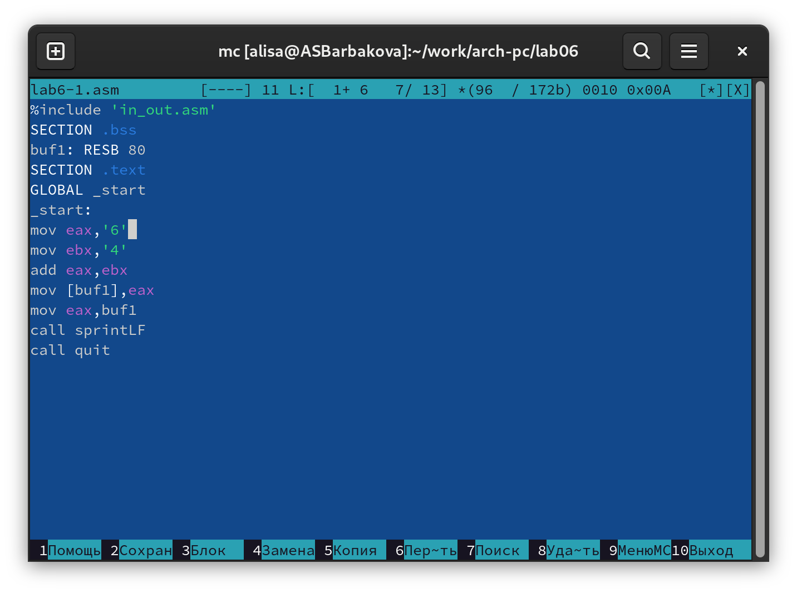{ #fig:003 width=70% }

Создаю исполняемый файл программы и запускаю его. Вывод программы: символ j (рис. [-@fig:004]).

{ #fig:004 width=70% }

Изменяю в тексте файла lab6-1.asm символы "6" и "4" на цифры 6 и 4 (рис. [-@fig:005]). 

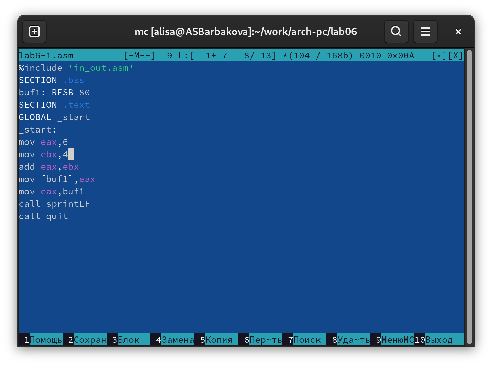{ #fig:005 width=70% }

Создаю новый исполняемый файл программы и запускаю его. Этот символ не отображается при выводе на экран, так как является символом перевода строки (рис. [-@fig:006]).

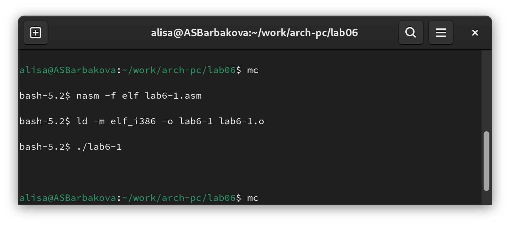{ #fig:006 width=70% }

Создаю новый файл lab6-2.asm с помощью touch (рис. [-@fig:007]).

{ #fig:007 width=70% }

Ввожу в файл текст другой программы для вывода значения регистра eax (рис. [-@fig:008]).

{ #fig:008 width=70% }

Создаю и запускаю исполняемый файл lab6-2. Выводится число 106 (рис. [-@fig:009]).

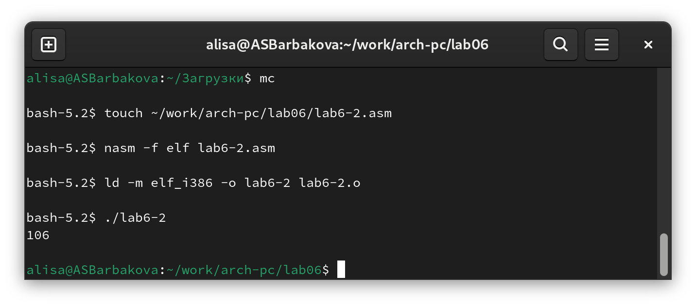{ #fig:009 width=70% }

Заменяю в тексте программы в файле символы "6" и "4" на числа 6 и 4 (рис. [-@fig:010]).

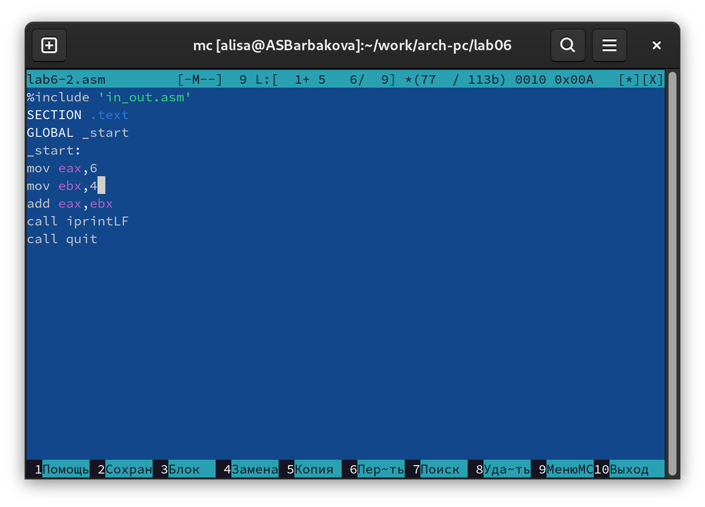{ #fig:010 width=70% }

Создаю и запускаю новый исполняемый файл. Теперь программа складывает не соответствующие символам коды в системе ASCII, а сами числа, поэтому вывод 10 (рис. [-@fig:011]).

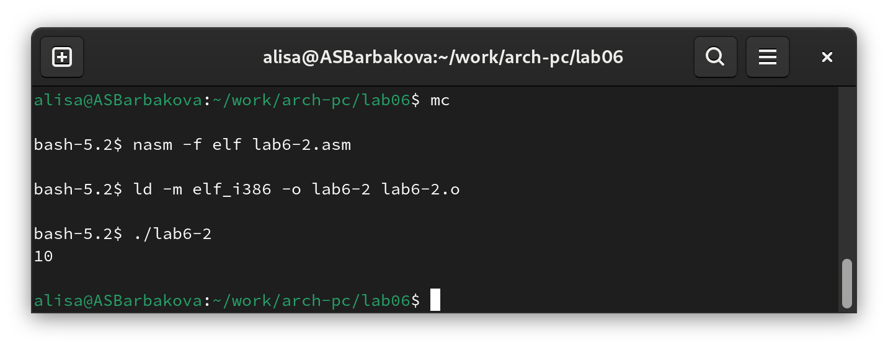{ #fig:011 width=70% }

Заменяю в тексте программы файла lab6-2.asm функцию iprintLF на iprint (рис. [-@fig:012]).

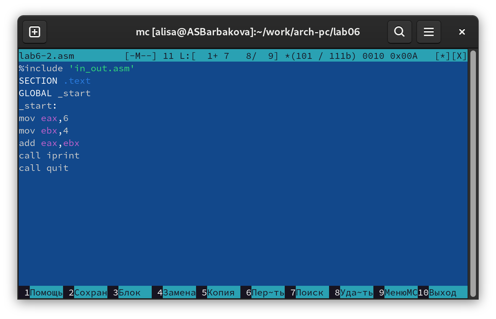{ #fig:012 width=70% }

Создаю и запускаю новый исполняемый файл (рис. [-@fig:013]). Вывод не изменился, потому что символ переноса строки не отображался, когда программа исполнялась с функцией iprintLF, а iprint не добавляет к выводу символ переноса строки.

{ #fig:013 width=70% }

## Выполнение арифметических операций в NASM

Создаю файл lab6-3.asm с помощью утилиты touch (рис. [-@fig:014]).

{ #fig:014 width=70% }

Ввожу в созданный файл текст программы для вычисления f(x) = (5 * 2 + 3)/3 (рис. [-@fig:015]).

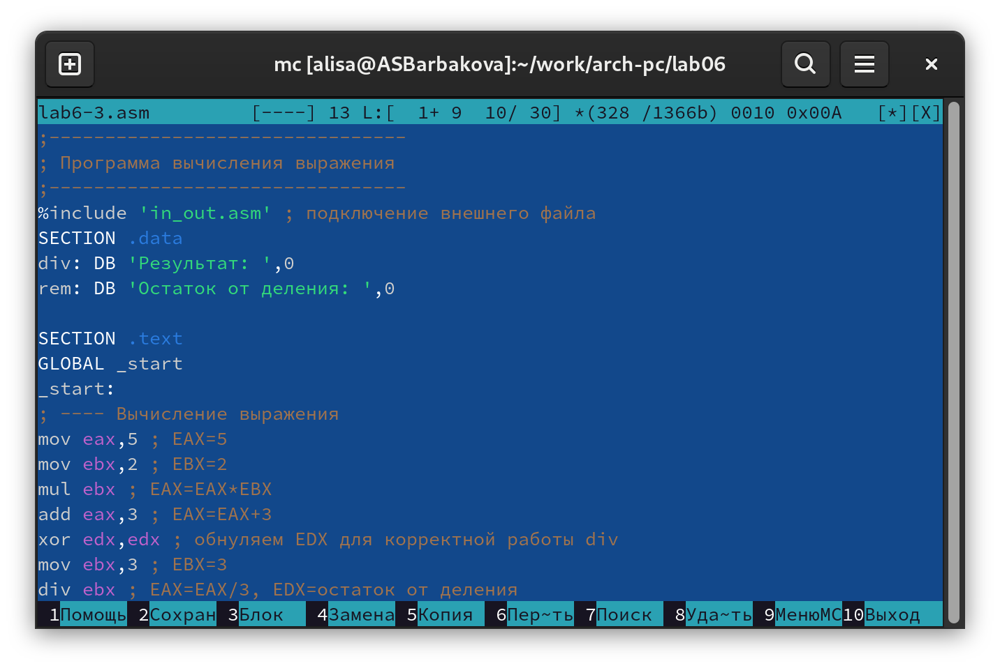{ #fig:015 width=70% }

Создаю исполняемый файл и запускаю его (рис. [-@fig:016]). Решение программы совпадает с ответом.

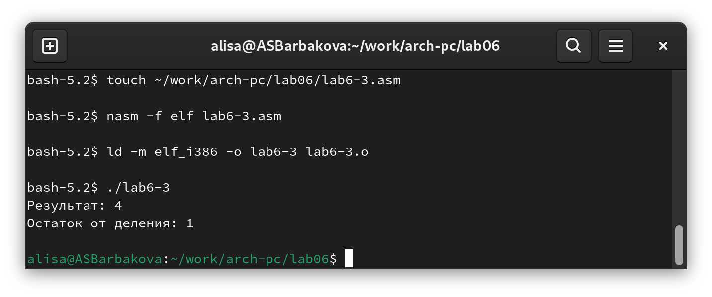{ #fig:016 width=70% }

Изменяю программу так, чтобы она вычисляла значение выражения f(x) = (4 * 6 + 2)/5 (рис. [-@fig:017]). 

{ #fig:017 width=70% }

Создаю и запускаю новый исполняемый файл (рис. [-@fig:018]). Программа сработала верно.

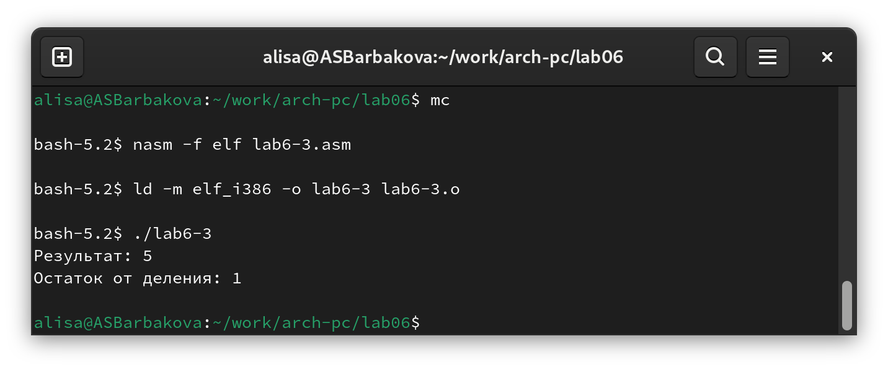{ #fig:018 width=70% }

Создаю файл variant.asm с помощью команды touch (рис. [-@fig:019]).

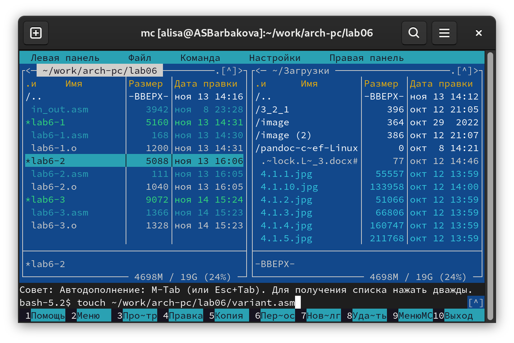{ #fig:019 width=70% }

Ввожу в файл текст программы для вычисления варианта задания по номеру моего студенческого билета (рис. [-@fig:020]).

{ #fig:020 width=70% }

Создаю и запускаю исполняемый файл (рис. [-@fig:021]). Ввожу номер своего студ. билета с клавиатуры. Программа выводит, что мой вариант - 8.

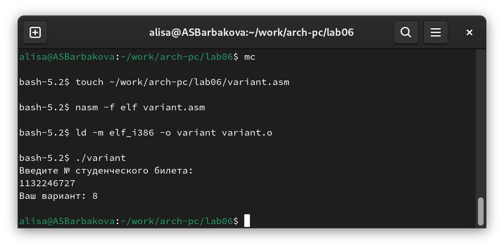{ #fig:021 width=70% }

### Ответы на вопросы по программе

1. За вывод сообщения "Ваш вариант" отвечают строки кода:

```NASM
mov eax,rem
call sprint
```
2. Инструкция mov ecx, x используется, чтобы положить адрес вводимой строки x в регистр ecx
mov edx, 80 - запись в регистр edx длины вводимой строки 
call sread - вызов подпрограммы из внешнего файла, обеспечивающей ввод сообщения с клавиатуры

3.  Инструкция `call atoi` вызывает подпрограмму `atoi` из внешнего файла, которая преобразует строку ASCII, находящуюся в `x`, в целое число и записывает его в регистр `eax`.

4. За вычисления варианта отвечают строки:

```NASM
xor edx,edx
mov ebx,20 
div ebx 
inc edx 
```

5. Остаток от деления записывается в регистр `edx` при div ebx.

6. Инструкция `inc edx` увеличивает значение в регистре `edx` на 1.

7. За вывод на экран результатов вычислений отвечают строки:

```NASM
mov eax,edx
call iprintLF
```

## Выполнение заданий для самостоятельной работы

Создаю файл task.asm с помощью утилиты touch. Открываю созданный файл для редактирования, ввожу в него текст программы для вычисления выражение под вариантом 8:
(11 + x) * 2 - 6 (рис. [-@fig:022]).

{ #fig:022 width=70% }

Создаю исполняемый файл (рис. [-@fig:023]).

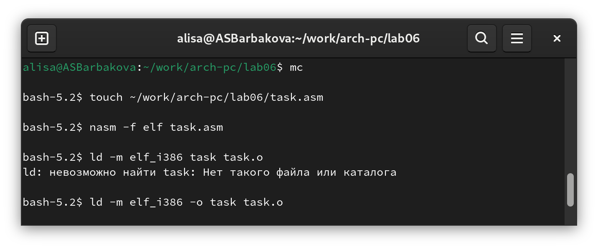{ #fig:023 width=70% }

Запускаю исполняемый файл, ввожу x1=1 (рис. [-@fig:024]).

{ #fig:024 width=70% }

Провожу еще один запуск исполняемого файла, ввожу x2=9 (рис. [-@fig:025]). Программа сработала верно.

{ #fig:025 width=70% }

**Программа для вычисления значения выражения (11 + x) * 2 − 6.**

```NASM
%include 'in_out.asm' 
SECTION .data 
msg: DB 'Введите значение переменной х: ',0
rem: DB 'Результат: ',0
SECTION .bss 
x: RESB 80 ; Переменная, значение которой будем вводить с клавиатуры
SECTION .text 
GLOBAL _start 
_start: 
; ---- Вычисление выражения
mov eax, msg 
call sprint 
mov ecx, x 
mov edx, 80 
call sread 
mov eax,x 
call atoi ; ASCII кода в число, `eax=x`
add eax,11; eax = eax+11 = x + 11
mov ebx,2 ; запись значения 2 в регистр ebx
mul ebx; EAX=EAX*EBX = (x+11)*2
add eax,-6; eax = eax-6 = (x+11)*2-6
mov edi,eax 
; ---- Вывод результата на экран
mov eax,rem 
call sprint 
mov eax,edi 
call iprint
call quit 
```

# Выводы

При выполнении данной лабораторной работы я освоила арифметические инструкции языка ассемблера NASM.

# Список литературы{.unnumbered}

1. [Лабораторная работа №6](https://esystem.rudn.ru/pluginfile.php/2089086/mod_resource/content/0/%D0%9B%D0%B0%D0%B1%D0%BE%D1%80%D0%B0%D1%82%D0%BE%D1%80%D0%BD%D0%B0%D1%8F%20%D1%80%D0%B0%D0%B1%D0%BE%D1%82%D0%B0%20%E2%84%966.%20%D0%90%D1%80%D0%B8%D1%84%D0%BC%D0%B5%D1%82%D0%B8%D1%87%D0%B5%D1%81%D0%BA%D0%B8%D0%B5%20%D0%BE%D0%BF%D0%B5%D1%80%D0%B0%D1%86%D0%B8%D0%B8%20%D0%B2%20NASM..pdf)
