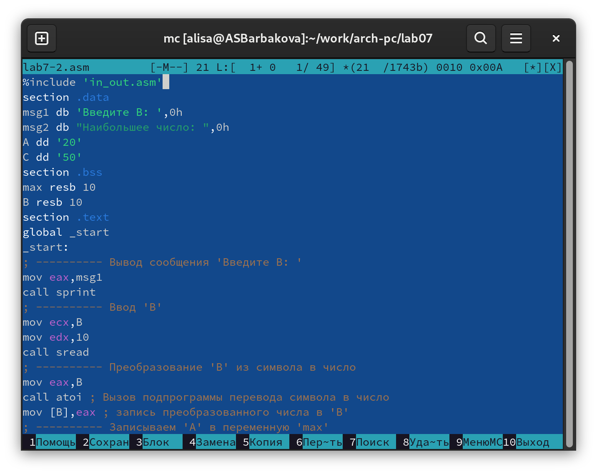
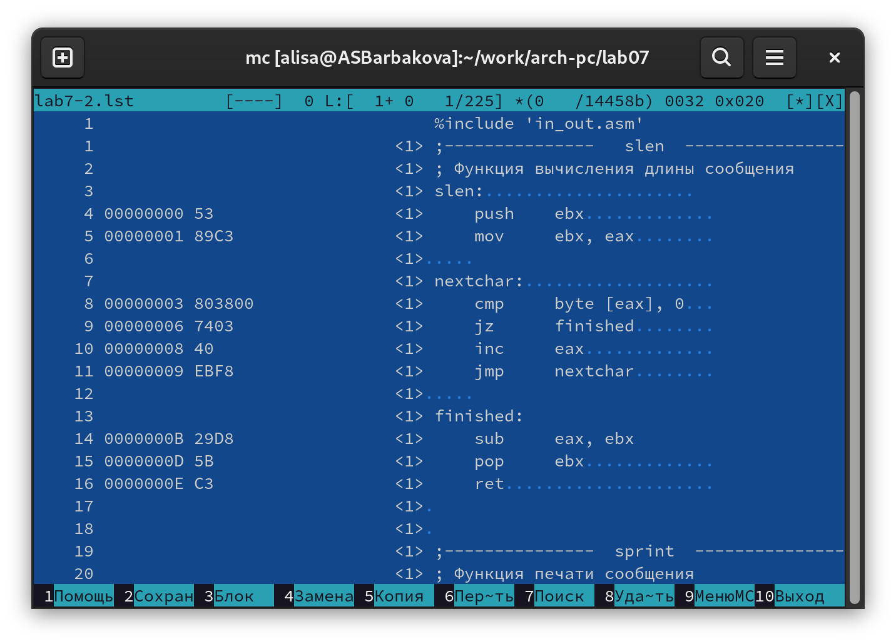

---
## Front matter
title: "Отчёт по лабораторной работе №7"
subtitle: "Дисциплина: архитектура компьютера"
author: "Барбакова Алиса Саяновна"

## Generic otions
lang: ru-RU
toc-title: "Содержание"

## Bibliography
bibliography: bib/cite.bib
csl: pandoc/csl/gost-r-7-0-5-2008-numeric.csl

## Pdf output format
toc: true # Table of contents
toc-depth: 2
lof: true # List of figures
fontsize: 13pt
linestretch: 1.5
papersize: a4
documentclass: scrreprt
## I18n polyglossia
polyglossia-lang:
  name: russian
  options:
	- spelling=modern
	- babelshorthands=true
polyglossia-otherlangs:
  name: english
## I18n babel
babel-lang: russian
babel-otherlangs: english
## Fonts
mainfont: IBM Plex Serif
romanfont: IBM Plex Serif
sansfont: IBM Plex Sans
monofont: IBM Plex Mono
mathfont: STIX Two Math
mainfontoptions: Ligatures=Common,Ligatures=TeX,Scale=0.94
romanfontoptions: Ligatures=Common,Ligatures=TeX,Scale=0.94
sansfontoptions: Ligatures=Common,Ligatures=TeX,Scale=MatchLowercase,Scale=0.94
monofontoptions: Scale=MatchLowercase,Scale=0.94,FakeStretch=0.9
mathfontoptions:
## Biblatex
biblatex: true
biblio-style: "gost-numeric"
biblatexoptions:
  - parentracker=true
  - backend=biber
  - hyperref=auto
  - language=auto
  - autolang=other*
  - citestyle=gost-numeric
## Pandoc-crossref LaTeX customization
figureTitle: "Рис."
tableTitle: "Таблица"
listingTitle: "Листинг"
lofTitle: "Список иллюстраций"
lolTitle: "Листинги"
## Misc options
indent: true
header-includes:
  - \usepackage{indentfirst}
  - \usepackage{float} # keep figures where there are in the text
  - \floatplacement{figure}{H} # keep figures where there are in the text
---


# Цель работы

Цель данной лабораторной работы - изучение команд условного и безусловного переходов, приобретение навыков написания программ с использованием переходов, знакомство с назначением и структурой файла листинга.

# Задание

1. Символьные и численные данные в NASM
2. Выполнение арифметических операций в NASM
3. Выполнение заданий для самостоятельной работы

# Теоретическое введение

Для реализации ветвлений в ассемблере используются так называемые команды передачи
управления или команды перехода. Можно выделить 2 типа переходов:  
• условный переход – выполнение или не выполнение перехода в определенную точку
программы в зависимости от проверки условия.  
• безусловный переход – выполнение передачи управления в определенную точку про-
граммы без каких-либо условий.  
Листинг (в рамках понятийного аппарата NASM) — это один из выходных файлов, созда-
ваемых транслятором. Он имеет текстовый вид и нужен при отладке программы, так как
кроме строк самой программы он содержит дополнительную информацию.  
Структура листинга:
• номер строки — это номер строки файла листинга (нужно помнить, что номер строки в
файле листинга может не соответствовать номеру строки в файле с исходным текстом
программы);  
• адрес — это смещение машинного кода от начала текущего сегмента;  
• машинный код представляет собой ассемблированную исходную строку в виде шестна-
дцатеричной последовательности. (например, инструкция int 80h начинается по сме-
щению 00000020 в сегменте кода; далее идёт машинный код, в который ассемблируется
инструкция, то есть инструкция int 80h ассемблируется в CD80 (в шестнадцатеричном
представлении); CD80 — это инструкция на машинном языке, вызывающая прерывание
ядра);  
• исходный текст программы — это просто строка исходной программы вместе с ком-
ментариями (некоторые строки на языке ассемблера, например, строки, содержащие
только комментарии, не генерируют никакого машинного кода, и поля «смещение» и
«исходный текст программы» в таких строках отсутствуют, однако номер строки им
присваивается).  

# Выполнение лабораторной работы

## Реализация переходов в NASM

Создаю каталог для программ лабораторной работы №7 и файл lab7-1.asm (рис. -@fig:001).

{#fig:001 width=70%}

Копирую в текущий каталог файл in_out.asm (рис. [-@fig:002]).

{ #fig:002 width=70% }

Копирую код из листинга в файл будущей программы. (рис. -@fig:003).

{#fig:003 width=70%}

Запускаю программу. Вижу, что неусловный переход действительно изменяет порядок выполнения инструкций (рис. -@fig:004).

{#fig:004 width=70%}

Изменяю программу таким образом, чтобы поменялся порядок выполнения функций (рис. -@fig:005).

{#fig:005 width=70%}

Запускаю программу и проверяю, что примененные изменения верны (рис. -@fig:006).

{#fig:006 width=70%}

Далее я изменяю текст программы так, чтобы все три сообщения вывелись в обратном порядке (рис. -@fig:007).

{#fig:007 width=70%}

Запускаю программу, сообщения выводятся в нужном мне порядке (рис. -@fig:008).

{#fig:008 width=70%}

Создаю новый рабочий файл lab7-2.asm и вставляю в него код из следующего листинга (рис. -@fig:009).

{#fig:009 width=70%}

Программа выводит значение переменной с максимальным значением, проверяю работу программы с разными входными данными (рис. -@fig:010).

{#fig:010 width=70%}

## Изучение структуры файла листинга

Создаю файл листинга с помощью команды nasm -f elf -l lab7-2.lst lab7-2.asm и открываю его с помощью текстового редактора mcedit (рис. -@fig:011).

{#fig:011 width=70%}

1. Строка 4: 00000000 53 <1> push ebx............  
Адрес: 00000000 — это адрес в памяти, где находится инструкция. Код операции: 53 — это байт-код ассемблерной инструкции push ebx. Эта инструкция помещает значение регистра ebx в стек.  
2. Строка 5: 00000001 89C3 <1> mov ebx, eax........  
Адрес: 00000001 — адрес в памяти, где эта инструкция будет выполнена. Код операции: 89C3 — это байт-код для инструкции mov ebx, eax. Инструкция копирует содержимое регистра eax в регистр ebx.  
3. Строка 8: 00000003 803800 <1> cmp byte [eax], 0...  
Адрес: 00000003 — адрес этой инструкции в памяти. Код операции: 803800 — это собственный код для инструкции cmp byte [eax], 0. Эта инструкция сравнивает байт, на который указывает eax, с нулем.  
Эти три строки из листинга вычисляет длину строки. Первая строка сохраняет состояние регистра, вторая сохраняет начало строки, а третья проверяет каждый символ строки на равенство нулю, что позволяет завершить вычисление длины строки.  

Удаляю один операнд из случайной инструкции, чтобы проверить поведение файла листинга в дальнейшем (рис. -@fig:012).

{#fig:012 width=70%}

Новый файл листинга у меня не создаётся, выходит ошибка при попытке трансляции файла. Никакие выходные файлы не создаются. (рис. -@fig:013).

{#fig:013 width=70%}

## Задания для самостоятельной работы

Для выполнения самостоятельной работы использую свой вариант - восьмой - из лабораторной работы №6. Копирую файл lab7-2.asm и изменяю программу так, чтобы она выводила переменную с наименьшим значением (рис. -@fig:014).

{#fig:014 width=70%}

Код первой программы: 

```NASM
%include 'in_out.asm'

SECTION .data
msg1 db 'Введите В: ', 0h
msg2 db 'Наименьшее число: ', 0h
A dd '52'
C dd '40'

SECTION .bss
min resb 10
B resb 10

SECTION .text
GLOBAL _start
_start:

mov eax, msg1
call sprint

mov ecx, B
mov edx, 10
call sread

mov eax, B
call atoi
mov [B], eax

mov ecx, [A]
mov [min], ecx

cmp ecx, [C]
jg check_B
mov ecx, [C]
mov [min], ecx

check_B:
mov eax, min
call atoi
mov [min], eax

mov ecx, [min]
cmp ecx, [B]
jb fin
mov ecx, [B]
mov [min], ecx

fin:
mov eax, msg2
call sprint
mov eax, [min]
call iprintLF
call quit

```

Проверяю корректность написания первой программы (рис. -@fig:015).

{#fig:015 width=70%}

Пишу программу, которая будет вычислять значение заданной функции согласно 8-му варианту для введенных с клавиатурых переменных a и x (рис. -@fig:016).

{#fig:016 width=70%}

Код второй программы: 

```NASM
%include 'in_out.asm'

SECTION .data
msg_x: DB 'Введите значение переменной x: ', 0
msg_a: DB 'Введите значение переменной a: ', 0
res: DB 'Результат: ', 0

SECTION .bss
x: RESB 80
a: RESB 80

SECTION .text
GLOBAL _start

_start:
    mov eax, msg_x
    call sprint
    mov ecx, x
    mov edx, 80
    call sread
    mov eax, x
    call atoi
    mov edi, eax

    mov eax, msg_a
    call sprint
    mov ecx, a
    mov edx, 80
    call sread
    mov eax, a
    call atoi
    mov esi, eax
    
    cmp esi, 3
    jl calculate_three_a

    mov eax, edi
    inc eax
    jmp print_result
calculate_three_a:
    mov eax, esi
    imul eax, 3
    
print_result:    
    mov edi, eax
    mov eax, res
    call sprint
    mov eax, edi
    call iprintLF
    call quit
```

Транслирую и компоную файл, запускаю и проверяю работу программы для различных значений a и x в соответствии с моим вариантом (рис. -@fig:017).

{#fig:017 width=70%}

# Выводы

При выполнении лабораторной работы я изучила команды условных и безусловных переходов, а также приобрела навыки написания программ с использованием переходов, познакомилась
с назначением и структурой файлов листинга.

# Список литературы{.unnumbered}

1. [Лабораторная работа №7](https://esystem.rudn.ru/pluginfile.php/2089087/mod_resource/content/0/%D0%9B%D0%B0%D0%B1%D0%BE%D1%80%D0%B0%D1%82%D0%BE%D1%80%D0%BD%D0%B0%D1%8F%20%D1%80%D0%B0%D0%B1%D0%BE%D1%82%D0%B0%20%E2%84%967.%20%D0%9A%D0%BE%D0%BC%D0%B0%D0%BD%D0%B4%D1%8B%20%D0%B1%D0%B5%D0%B7%D1%83%D1%81%D0%BB%D0%BE%D0%B2%D0%BD%D0%BE%D0%B3%D0%BE%20%D0%B8%20%D1%83%D1%81%D0%BB%D0%BE%D0%B2%D0%BD%D0%BE%D0%B3%D0%BE%20%D0%BF%D0%B5%D1%80%D0%B5%D1%85%D0%BE%D0%B4%D0%BE%D0%B2%20%D0%B2%20Nasm.%20%D0%9F%D1%80%D0%BE%D0%B3%D1%80%D0%B0%D0%BC%D0%BC%D0%B8%D1%80%D0%BE%D0%B2%D0%B0%D0%BD%D0%B8%D0%B5%20%D0%B2%D0%B5%D1%82%D0%B2%D0%BB%D0%B5%D0%BD%D0%B8%D0%B9..pdf)
